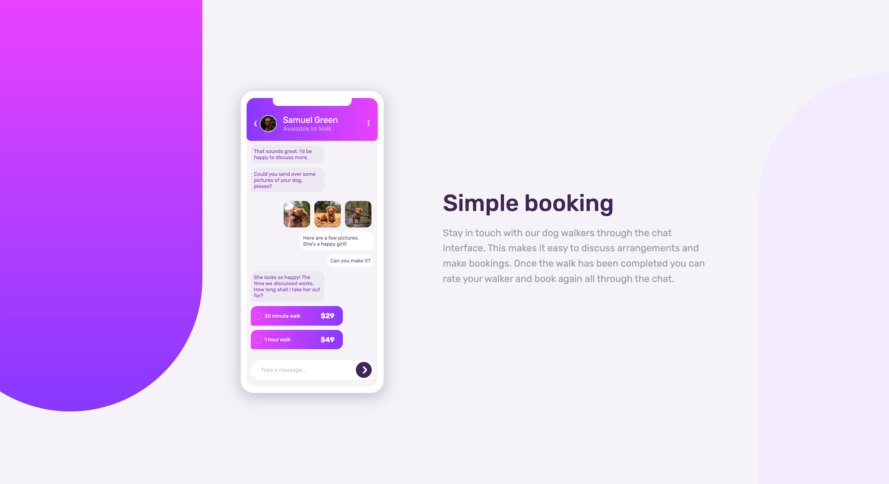

# Frontend Mentor - Chat app CSS illustration solution

This is a solution to the [Chat app CSS illustration challenge on Frontend Mentor](https://www.frontendmentor.io/challenges/chat-app-css-illustration-O5auMkFqY). Frontend Mentor challenges help you improve your coding skills by building realistic projects.

### The challenge

Users should be able to:

- View the optimal layout for the component depending on their device's screen size
- **Bonus**: See the chat interface animate on the initial load

### Screenshot

### Links

- Live Site URL: [ https://stetu281.github.io/frontendmentor-css-chat-app/](https://stetu281.github.io/frontendmentor-css-chat-app/)

### Built with

- Html
- Scss
- Webpack

## Author

- Website - [Stefan](https://www.stefanturner.ch)
- Frontend Mentor - [@stetu281](https://www.frontendmentor.io/profile/stetu281)
